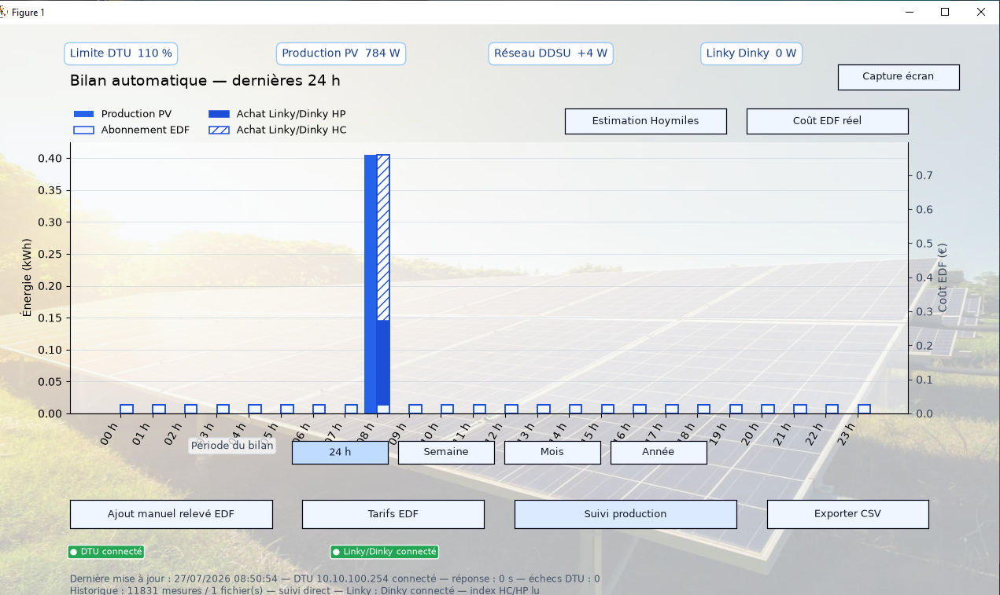

# Boîte noire Hoymiles — DTU Pro-S, DDSU666, Linky et Dinky 4

> **Surveiller localement une installation photovoltaïque Hoymiles et comparer les mesures du DTU/DDSU666 avec les données réelles du Linky.**

[](https://github.com/rolliurs-jpg/Homlis-DTU-PRO-S/releases)
[](LICENSE)
[](https://www.python.org/)

**Boîte noire Hoymiles** est une application Python locale pour Windows qui lit directement un **DTU Pro-S Hoymiles**, un **Linky Téléinfo** via **Dinky 4 / Tasmota**, et met en évidence les écarts éventuels avec le **DDSU666**. Les données restent sur votre ordinateur.

🌐 **Présentation et guide visuel :** activez GitHub Pages sur le dossier `docs` pour publier la vitrine du projet.


## Pourquoi ce logiciel ?

Les données remontées par S-Miles Cloud, le DTU et le DDSU ne correspondent pas toujours à la puissance réellement soutirée au réseau. Cette application permet de conserver un historique local et de comparer, sur la même période :

- la **production photovoltaïque** remontée par le DTU Pro-S ;
- la puissance réseau / estimation du **DDSU666** ;
- la puissance et les index **réels du Linky**, lus par le Dinky 4 ;
- les achats EDF en **heures pleines (HP)**, **heures creuses (HC)** et l’abonnement.

Le Linky/Dinky est la source utilisée pour le bilan EDF. Le DDSU reste affiché comme indicateur technique et de comparaison.

## Fonctionnalités

- Lecture locale du **DTU Pro-S** avec `hoymiles-wifi`.
- Lecture du **Linky Téléinfo** et des index HP/HC avec Dinky 4 / Denky compatible Tasmota.
- Courbes de production PV, réseau DDSU, Linky/Dinky et limite DTU.
- Vues **direct**, **24 h**, **hier** et **historique**.
- Bilan automatique sur 24 h, 7 jours, mois et année.
- Coût EDF calculé à partir du Linky : HP, HC et abonnement réglables.
- Comparatif énergie **Hoymiles / Linky** pour identifier les écarts DDSU ↔ Linky.
- Export CSV filtrable par plage de dates.
- Captures PNG datées et versionnées pour le support Hoymiles.
- Indicateurs de connexion DTU et Linky/Dinky.

## Installation rapide Windows

1. Sur cette page, cliquez sur **Code → Download ZIP**, puis décompressez l’archive.
2. Double-cliquez sur **`INSTALLER_WINDOWS.vbs`**.
3. Confirmez l’installation et choisissez votre mode réseau DTU.
4. Lancez le raccourci **Boîte noire Hoymiles** créé sur le Bureau.

L’installateur ne laisse pas de fenêtre de terminal ouverte. Il installe les dépendances, sauvegarde les réglages et historiques déjà présents, puis crée le raccourci.

### Prérequis

- Windows 10 ou Windows 11 ;
- Python 3.10 ou plus récent, installé avec l’option **Add Python to PATH** ;
- connexion Internet uniquement lors de la première installation ;
- DTU Pro-S et Dinky accessibles depuis l’ordinateur.

## Réseau : deux configurations possibles

### Configuration A — deux réseaux simultanés

Le **Dinky 4** est relié à la box et l’ordinateur le consulte par le **Wi-Fi de la box**. Le **DTU Pro-S** diffuse son propre Wi-Fi. L’ordinateur doit donc disposer de deux connexions Wi-Fi actives : le Wi-Fi interne vers la box et le Dinky, puis un second adaptateur Wi-Fi USB vers le DTU.

```text
Linky ── Téléinfo ──> Dinky 4 ── Wi-Fi de la box ──> PC
                                                    │
DTU Pro-S ─────────── Wi-Fi propre au DTU ── 2e Wi-Fi du PC
```

### Configuration B — un réseau unique

Si le DTU est raccordé à la box en **Ethernet**, le DTU et le Dinky peuvent être sur le même réseau local. L’installateur permet de saisir l’adresse IP attribuée au DTU par la box. Le DTU n’utilise pas le Wi-Fi de la box : son Wi-Fi reste son réseau propre.

> Si le Wi-Fi du DTU se coupe, le Dinky peut continuer à enregistrer le Linky mais la production PV ne sera plus relevée jusqu’à la reconnexion du DTU.

## Paramétrage et données locales

Le premier lancement crée :

`%LOCALAPPDATA%\BoiteNoireHoymiles\config_v5.json`

Vous pouvez ensuite fermer le logiciel et modifier l’adresse du DTU, du Dinky, ainsi que les tarifs EDF. Un modèle sans information personnelle est disponible dans [config.example.json](config.example.json).

Les données restent sur votre PC :

| Donnée | Emplacement |
| --- | --- |
| Historique production | `%LOCALAPPDATA%\BoiteNoireHoymiles\hoymiles_log.csv` |
| Index Linky/Dinky | `%LOCALAPPDATA%\BoiteNoireHoymiles\linky_index_log.csv` |
| Réglages | `%LOCALAPPDATA%\BoiteNoireHoymiles\config_v5.json` |

Ne publiez jamais votre `config_v5.json`, vos adresses IP, numéros de série ou mots de passe.

## Bilan EDF réel et comparatif DDSU666

Le bilan EDF s’appuie sur les index HP/HC du Linky obtenus par le Dinky. Il ne se base pas sur la puissance DDSU.



Le comparatif distingue volontairement :

| Mesure | Usage dans le logiciel |
| --- | --- |
| Production PV du DTU | Suivi de la génération solaire |
| DDSU666 | Indicateur Hoymiles, comparaison technique |
| Linky/Dinky | Référence pour la consommation et le coût EDF |

Ce projet n’envoie **aucune commande de zéro-injection**. Cette fonction reste gérée par le DTU et/ou S-Miles Cloud.

## Support et contribution

Vous pouvez ouvrir une [Issue GitHub](https://github.com/rolliurs-jpg/Homlis-DTU-PRO-S/issues) pour signaler une compatibilité DTU, DDSU666, Dinky/Denky ou Linky, ou joindre une capture exportée par l’application.

Pour rester utile à tous, indiquez la version du logiciel, le modèle DTU et le type de Dinky, mais masquez toute donnée personnelle et tout identifiant réseau.

## Projet communautaire indépendant

Ce projet est indépendant et non affilié à Hoymiles, Enedis, EDF, Tasmota ou S-Miles Cloud. Les valeurs affichées sont des aides de suivi ; elles ne remplacent pas les relevés contractuels d’Enedis ou d’EDF.

## Licence

Licence [MIT](LICENSE).
