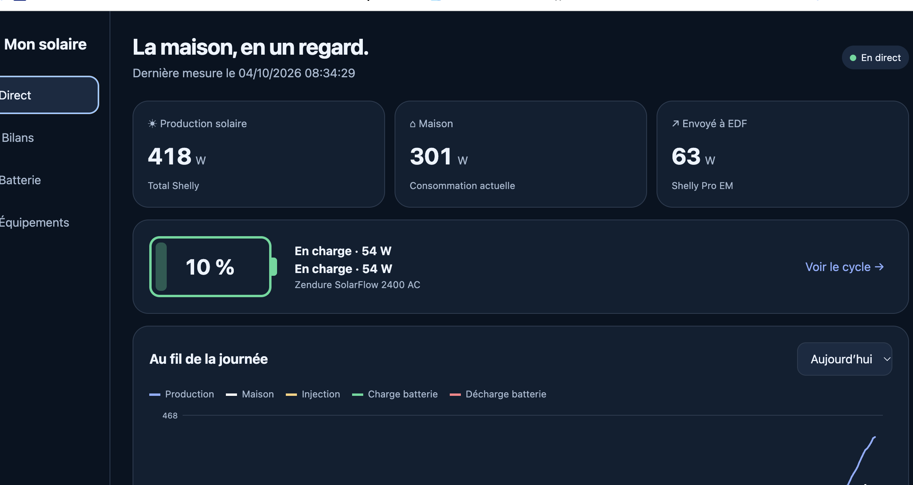

# Boîte noire Hoymiles — DTU Pro-S, Linky/Dinky et Shelly Pro EM

**Version 7.0.63 : installateur Raspberry Pi téléchargeable, suivi du nano-routeur TP-Link et bilan batterie plus fiable.**
Le bouton Alarmes surveille l’absence de mesures sur PC, Mac et dans le tableau mobile ouvert. Pour une notification même ordinateur éteint, configurer le service extérieur décrit dans ce guide.

> Suivi solaire local sur Windows, macOS et Raspberry Pi, consultable depuis Android, iPhone, iPad, Mac et Windows avec l'interface web privée.

[](RELEASE_NOTES_7.0.63.md)
[](LICENSE)
[](https://www.python.org/)

**[Télécharger l’installateur Raspberry Pi](https://github.com/rolliurs-jpg/Homlis-DTU-PRO-S/releases/latest/download/3-RASPBERRY-Hoymiles-7.0.63-INSTALLATEUR.tar.gz)** · **[Guide Raspberry Pi](raspberry-pi/README.md)** · **[Télécharger pour macOS Apple Silicon](https://github.com/rolliurs-jpg/Homlis-DTU-PRO-S/releases/latest/download/1-MAC-Hoymiles-7.0.62-INSTALLATEUR.tar.gz)** · **[Télécharger le paquet Windows complet](https://github.com/rolliurs-jpg/Homlis-DTU-PRO-S/releases/latest/download/2-WINDOWS-Hoymiles-7.0.62-COMPLET.zip)** · [Site du projet](https://rolliurs-jpg.github.io/Homlis-DTU-PRO-S/)

Sur la page GitHub, choisissez uniquement le fichier commençant par **1-MAC**, **2-WINDOWS** ou **3-RASPBERRY**. Les liens « Source code » ajoutés automatiquement par GitHub ne sont pas les installateurs.



## Disponible sur toutes vos plateformes

| Plateforme | Disponibilité | Utilisation |
| --- | --- | --- |
| Windows | Application complète | Collecte permanente, historique, réglages et nouvelle interface. |
| macOS Apple Silicon | Application complète | Collecte permanente avec installateur autonome et sauvegarde avant mise à jour. |
| Raspberry Pi | **Collecteur recommandé** | Service systemd, historique local et tableau web privé, sans laisser un Mac ou un PC allumé. |
| Android | Interface web | Chrome sur le Wi-Fi local ou via Tailscale ; ajout possible à l’écran d’accueil. |
| iPhone / iPad | Interface web | Safari sur le Wi-Fi local ou via Tailscale ; ajout possible à l’écran d’accueil. |

Android et iPhone utilisent la même interface moderne, sans application de magasin. Pour une installation permanente, le Raspberry Pi est recommandé : il collecte et sert les données jour et nuit. Windows ou macOS restent des alternatives de bureau. N'exécutez qu'un seul collecteur à la fois.

## Choisir la bonne version réseau

| Système | Configuration proposée | Usage |
| --- | --- | --- |
| Windows | **Deux connexions Wi-Fi** | Wi-Fi interne vers la box/Dinky/Shelly et seconde antenne Wi-Fi vers le DTU. |
| Windows | **Réseau unique nano-routeur/LAN — recommandé** | DTU en Ethernet sur le nano-routeur Client/Pont ; PC, Dinky et Shelly sur la box. |
| macOS Apple Silicon | **Réseau unique nano-routeur/LAN uniquement** | Même réseau pour tous les appareils, sans changement de Wi-Fi sur le Mac. |
| Raspberry Pi | **Ethernet vers la box + Wi-Fi dédié ESP32** | Ethernet pour DTU/Linky/Shelly ; Wi-Fi séparé pour le proxy ESP32 si nécessaire. |

Le choix se fait pendant l’installation Windows. L’installation Mac demande directement l’adresse IP du DTU sur le réseau unique.

## Installation Windows

1. Téléchargez le paquet **Windows uniquement** depuis la page des versions et décompressez-le complètement.
2. Double-cliquez sur `INSTALLER_WINDOWS.vbs`.
3. Choisissez l’une des deux configurations réseau du tableau ci-dessus.
4. Saisissez les adresses IP demandées, puis lancez le raccourci créé sur le Bureau.

À chaque clic sur le raccourci, choisissez **Nouvelle interface web** ou **Ancien logiciel avec sa fenêtre**. Le changement de mode arrête proprement le service invisible afin d’éviter deux collectes simultanées.

Une mise à jour conserve les réglages et historiques existants. Python 3.10 ou plus récent est requis.

## Installation macOS Apple Silicon

> **Découverte importante lors des essais réels :** téléchargez l’archive depuis GitHub **directement sur le Mac**, puis décompressez-la sur ce même Mac avec l’utilitaire d’archive intégré à macOS. Un téléchargement ou une extraction passant par Windows peut rendre l’application impossible à ouvrir. N’utilisez pas **The Unarchiver** pour ce paquet : il a déjà produit une extraction incomplète.

1. Configurez d’abord le nano-routeur en **mode Client/Pont** sur le Wi-Fi 2,4 GHz de la box.
2. Reliez le port Ethernet du DTU au nano-routeur.
3. Depuis le navigateur du Mac, téléchargez le paquet **Mac – installateur autonome TAR.GZ** directement sur le Mac. Ne le téléchargez pas d’abord sous Windows et ne transférez pas une application déjà extraite.
4. Décompressez-le avec l’utilitaire d’archive intégré à macOS. Le dossier contient **1 - INSTALLER BOITE NOIRE HOYMILES.app**, **2 - SI LE MAC REFUSE - INSTALLER.command** et **3 - LIRE-MOI-MAC.txt**.
5. Faites un clic droit sur le premier installateur, puis choisissez **Ouvrir**. Si macOS le refuse, utilisez le deuxième lanceur par **clic droit → Ouvrir** : il répare les autorisations avant l’installation.
6. Saisissez les IP réservées du DTU, du Dinky et du Shelly.

Le lanceur appelle explicitement Bash et conserve l’identité de l’application pendant l’exécution : l’installation résiste à la perte des droits du ZIP et macOS peut attribuer correctement l’autorisation de réseau local.

### Autorisation du réseau local sur macOS 15.5 ou plus récent

Si les appareils restent hors ligne avec l’erreur `No route to host` alors qu’ils répondent depuis Terminal, macOS bloque le lanceur communautaire non signé par un compte Apple Developer. La solution officielle Apple consiste à autoriser le sous-réseau Wi-Fi local. Pour une box utilisant des adresses `192.168.1.x`, exécutez dans Terminal :

```bash
sudo defaults write com.apple.network.local-network AllowedWiFiLocalNetworkAddresses -array-add "192.168.1.0/24"
```

Le mot de passe ne s’affiche pas pendant la saisie. Redémarrez ensuite complètement le Mac. Cette exception concerne toutes les applications qui accèdent au sous-réseau `192.168.1.x`, pas uniquement Boîte noire Hoymiles. Procédure validée sous macOS 27.0. Voir la [note technique Apple TN3179](https://developer.apple.com/documentation/technotes/tn3179-understanding-local-network-privacy).

L’installateur place un seul lanceur dans `/Applications` et un raccourci sur le Bureau. Avant chaque mise à jour, il sauvegarde les CSV, JSON et journaux dans `~/Library/Application Support/BoiteNoireHoymiles/Sauvegardes`. Voir le [guide Mac détaillé](macOS-AppleSilicon/README_MAC.md).

Le lanceur Mac propose lui aussi **Nouvelle interface web** ou **Ancien logiciel**. Lorsque l’ancienne fenêtre est ouverte, le service invisible est suspendu puis réactivé à sa fermeture si le démarrage automatique est activé.

Le paquet communautaire n’est pas notarisé par Apple. La première ouverture peut donc demander une validation et l’autorisation d’accéder au réseau local.

## Réseau unique recommandé

```text
DTU Pro-S ── Ethernet ──> nano-routeur en mode Client/Pont ── Wi-Fi ──┐
Linky ── Téléinfo ──> Dinky 4 ─────────────────────────────── Wi-Fi ──┼──> Box ──> Windows ou Mac
Shelly Pro EM ─────────────────────────────────────────────── Wi-Fi ──┘
```

Le **[TP-Link TL-WR802N](https://www.tp-link.com/fr/home-networking/wifi-router/tl-wr802n/)** convient : choisissez **Client** puis **Smart IP (DHCP)**. La box doit rester l’unique serveur DHCP. Réservez ensuite une IP fixe au DTU, au Dinky et au Shelly dans la box.

Pour lire localement la production par Modbus TCP, le port 502 du DTU doit être accessible. Sur l’installation testée, cela correspond au réglage RS485 **Remote Control / Modbus Protocol**, adresse `101`. Attention : selon le firmware Hoymiles, ce choix peut rendre le DDSU et la gestion d’exportation Hoymiles indisponibles. Si votre zéro-injection dépend du DDSU, vérifiez son fonctionnement avant de conserver ce réglage.

## Fonctions principales

- production photovoltaïque locale par DTU Pro-S (Wi-Fi direct Windows ou Modbus TCP sur LAN) ;
- puissance et index HP/HC du Linky par Dinky 4 ;
- deux voies Shelly Pro EM en lecture seule : production et achat/injection réseau ;
- vues direct, 24 h, hier et historique ;
- bilan EDF fondé sur les index Linky, export CSV, captures et rapport SAV ;
- continuité des mesures Dinky/Shelly lorsque le DTU est momentanément indisponible ;
- seconde tentative automatique du Dinky avant de signaler une coupure ;
- couleurs distinctes : production PV en bleu foncé pur, Linky/Dinky en vert, les deux mesures Shelly en jaune lumineux, DDSU en rouge et limite DTU en bleu ;
- curseur organisé avec les mêmes couleurs de groupe pour faciliter la comparaison ;
- zone négative transparente, avec son indication placée à gauche pour préserver les mesures récentes à droite ;
- valeurs DTU indisponibles affichées clairement, sans valeur `nan` ;
- production et réseau Shelly affichés en jaune lumineux, y compris dans le suivi du curseur ;
- échelle verticale automatiquement agrandie lorsque l’injection dépasse −500 W ;
- boîte du curseur placée dans le graphique, sous les titres et la légende, avec un fond renforcé ;
- boîte du curseur automatiquement ouverte vers l’intérieur dès le milieu du graphique ;
- alignement réel de la bulle corrigé pour que ce basculement fonctionne effectivement avec Matplotlib ;
- alerte et cumul de l’injection mesurée par le Shelly.
- tableau de bord mobile en lecture seule, utilisable sur le Wi-Fi local ou à distance avec Tailscale.
- âge visible de la dernière mesure et état direct, retardé ou ancien sur mobile ;
- provenance des valeurs : production DTU réelle, secours Shelly, données partielles ou absentes ;
- analyse mensuelle de la qualité des données et simulation de batteries 2, 5, 7 et 10 kWh ;
- rapport mensuel PDF créé localement, avec énergie, coupures observées et hypothèses de batterie.

Le logiciel ne commande ni le relais Shelly ni le zéro-injection Hoymiles.

## Raspberry Pi, accès web et sécurité

Le Raspberry Pi peut héberger le collecteur en continu avec son service
systemd. Il reprend les mêmes sources de mesure que les éditions de bureau et
sert le tableau web sur le port `8765`. Le guide complet, le modèle de service
et la procédure d'accès privée sont disponibles dans
[raspberry-pi/README.md](raspberry-pi/README.md).

Lorsqu'un Raspberry est le collecteur actif, n'utilisez pas en parallèle la
gestion solaire de l'ancienne application Mac ou Windows : elle ne constitue
plus qu'un outil de secours. Le navigateur ouvre alors exactement la même
interface sur tous les appareils.

Conservez le réglage web **Démarrage automatique** sur **Non** sur Raspberry :
systemd lance déjà le collecteur au démarrage. Le serveur refuse les connexions
Internet publiques ; n'ouvrez aucun port de la box et n'activez pas Tailscale
Funnel. Réservez Tailscale à l'accès privé distant.

## Second ensemble de panneaux indépendant : liaison ESP32 Wi-Fi + Bluetooth

Le Raspberry peut aussi réunir les mesures d'un second ensemble de panneaux,
indépendant du DTU Pro-S principal. Cette liaison complémentaire utilise deux
ESP32 :

- **ESP32 routeur solaire** : crée le relais Wi-Fi entre le local technique et
  le Raspberry, même lorsque les panneaux sont éloignés de la box ;
- **ESP32 proxy Bluetooth Hoymiles** : se place près des micro-onduleurs du
  second ensemble et remonte leurs informations par Bluetooth.

Le routeur assure la distance en Wi-Fi ; le proxy assure la liaison Bluetooth
locale avec les micro-onduleurs. Le tableau web affiche leur disponibilité dans
**Équipements** afin de distinguer une coupure du relais Wi-Fi d'une absence de
liaison Bluetooth. Ces ESP32 complètent le DTU Pro-S : ils ne remplacent ni sa
configuration ni le suivi de l'ensemble principal.

## Android, iPhone, Mac, Windows et accès à distance

La version 7.0.62 démarre la nouvelle interface web sur le port `8765`. Elle reprend les mesures déjà collectées par le logiciel : elle ne crée aucune connexion supplémentaire vers la DTU, le Dinky ou le Shelly.

1. Lancez le seul collecteur choisi — de préférence le Raspberry Pi avec son service systemd.
2. À la maison, ouvrez `http://IP_DU_RASPBERRY:8765/` dans Chrome (Android), Safari (iPhone/iPad), Safari/Chrome (Mac) ou Edge/Chrome (Windows).
3. Pour l’accès à distance, installez [Tailscale](https://tailscale.com/download) sur le Raspberry et chaque appareil client, puis connectez-les au même tailnet.
4. Hors de la maison, ouvrez `http://IP_TAILSCALE_DU_RASPBERRY:8765/`. L’adresse privée Tailscale commence généralement par `100.` et reste stable.
5. Sur Raspberry, obtenez cette adresse avec `tailscale ip -4`. Sur Android, Chrome → menu `⋮` → **Installer l’application** ou **Ajouter à l’écran d’accueil** crée un bouton « Mon solaire ».

Le tableau affiche la production, la consommation réelle calculée avec le Shelly, le soutirage ou l’injection, la mesure Linky/Dinky, l’état des trois appareils et les dernières heures sous forme de graphique. Il est entièrement en lecture seule.

L’âge de la mesure est contrôlé indépendamment de la connexion au serveur : vert jusqu’à 90 secondes, orange en cas de retard et rouge lorsque les données sont anciennes. La source de production et la qualité de la mesure sont également indiquées.

Dans **Bilan consommation**, le bouton **Rapport + batterie** analyse automatiquement le mois en cours. Il compare les capacités 2, 5, 7 et 10 kWh et permet de créer un PDF local. La simulation utilise les flux réellement enregistrés par le Shelly, avec un rendement aller-retour de 90 %, une limite de 2 000 W et une batterie vide au début de la période. Elle sert à comparer les tailles, pas à commander l’installation.

Sur téléphone, Windscribe et Tailscale ne doivent pas être utilisés en même temps. Windscribe peut interrompre temporairement l’accès au tableau ; après l’avoir coupé, réactivez Tailscale si la connexion ne revient pas automatiquement.

Depuis Chrome Android ou Safari iPhone/iPad, utilisez **Ajouter à l’écran d’accueil** pour créer une icône solaire ouvrant directement l’interface comme une application. Il ne s’agit pas d’une application native publiée sur Google Play ou l’App Store.

N’ouvrez aucun port de la box et n’utilisez pas **Tailscale Funnel** : le tableau doit rester limité à votre réseau local et à votre réseau privé Tailscale. Activez l'authentification à deux facteurs du compte Tailscale, utilisez un compte par personne et gardez les ESP32 protégés par WPA2/WPA3. Le collecteur et Tailscale doivent rester actifs pour une consultation pendant les vacances. Si le pare-feu Windows demande une autorisation pour Python, autorisez le réseau privé utilisé par l’installation.

## Données locales

| Système | Dossier |
| --- | --- |
| Windows | `%LOCALAPPDATA%\BoiteNoireHoymiles` |
| macOS | `~/Library/Application Support/BoiteNoireHoymiles` |

Ne publiez jamais `config_v5.json`, vos adresses IP, numéros de série ou mots de passe. Un modèle neutre est fourni dans [config.example.json](config.example.json).

## Support, licence et indépendance

Signalez un problème dans les [Issues GitHub](https://github.com/rolliurs-jpg/Homlis-DTU-PRO-S/issues) en indiquant la version, le modèle de DTU et une capture sans donnée personnelle.

Le logiciel est distribué sous [licence MIT](LICENSE). C’est un projet communautaire indépendant, non affilié à Hoymiles, Enedis, EDF, Tasmota, S-Miles Cloud ou TP-Link. Un [don facultatif](https://paypal.me/RolliursHoymiles) peut soutenir son développement.

## Alarmes : PC, Mac et téléphone

Le bouton **Alarmes** signale cinq minutes sans mesure valide enregistrée. Une production nocturne à 0 W est valide. Les interruptions et reprises sont conservées dans un journal local ; une panne partielle reste visible dans l’état des appareils.

Pour être averti même ordinateur éteint, créez un contrôle Healthchecks distinct pour **chaque ordinateur** : **Period = 1 minute**, **Grace Time = 4 minutes**. Collez son URL privée dans Alarmes (Ctrl+V sous Windows, **⌘+V sur Mac**) et enregistrez. Les espaces copiés sont corrigés automatiquement et une confirmation verte apparaît. Cette URL n’est pas l’adresse IP utilisée pour l’appli mobile.

Dans Healthchecks, ajoutez **Email** dans Intégrations, validez l’adresse puis activez-la pour les contrôles concernés. Vérifiez le premier ping et le mail de test. Les SMS dépendent du quota de votre offre ; un quota de zéro empêche leur envoi. Aucun SMS n’est nécessaire pour les alarmes par mail.

Le tableau mobile, y compris via **Tailscale**, affiche l’alarme lorsqu’il est ouvert. Pour une notification téléphone verrouillé ou appli fermée, le canal extérieur configuré dans Healthchecks est indispensable. Une coupure Internet, électrique ou un arrêt du logiciel provoquent la même absence de signal : l’alerte ne permet pas d’en identifier la cause à elle seule.

Les URL privées restent sur chaque ordinateur. Pour une maintenance volontaire, mettez temporairement le contrôle Healthchecks en pause et réactivez-le à la reprise. Les réglages et historiques sont conservés lors de la mise à jour.

## Choisir les équipements de mesure

Le DTU Hoymiles reste la source de production habituelle. En complément, choisissez
dans le bouton **Équipements** du logiciel :

| Configuration | Utilisation |
| --- | --- |
| Linky / Dinky seul | Solution économique pour lire la téléinformation du Linky et ses index d’achat HC/HP. La production solaire reste fournie par le DTU. |
| Shelly Pro EM seul | Solution plus coûteuse, avec une mesure indépendante de la production et du flux réseau, selon le câblage des deux voies. Le bilan d’achat est une estimation calculée sur les puissances enregistrées. |
| Linky / Dinky + Shelly Pro EM | Index du compteur pour le bilan d’achat et mesures Shelly pour la production indépendante, le flux réseau et les comparaisons. Les deux mesures réseau ne sont jamais additionnées. |

Ces choix concernent les équipements complémentaires : « Dinky seul » ne signifie
pas que le Dinky mesure la production des panneaux. L’injection disponible par
téléinformation dépend des champs publiés par le compteur et le firmware ; une
puissance de soutirage n’est pas une mesure signée d’injection.

Cochez les équipements utilisés, renseignez leur adresse IP ou nom réseau, puis
**Enregistrer**. Fermez et relancez le logiciel pour appliquer le choix. Les réglages
avancés existants et les historiques sont conservés. Les courbes, légendes, bulles,
états et cartes mobiles des équipements désactivés sont masqués. Un équipement
activé qui tombe en panne reste visible : une coupure ne doit pas disparaître de l’écran.

Avec le Shelly seul, le partage HC/HP utilise les plages configurées dans **Tarifs EDF**.
Le calcul porte sur les mesures enregistrées et limite chaque intervalle à trois
minutes : les interruptions de collecte peuvent sous-estimer l’énergie. Il ne
remplace pas les index du compteur ni une facture. Les relevés EDF saisis manuellement
restent identifiés séparément. Les fonctions d’analyse nécessitant le Shelly ne
sont proposées que lorsqu’il est activé ; la comparaison Linky/Hoymiles nécessite le Dinky.

Sur mobile, les cartes maison et flux signé nécessitent les mesures Shelly ; la
carte Dinky affiche sa mesure de téléinformation. Aucun flux d’injection n’est inventé
à partir d’un soutirage nul.


### Si macOS refuse l’ouverture de l’installateur

Retéléchargez exclusivement l’archive **TAR.GZ directement sur le Mac**. Ne passez pas par Windows et n’utilisez pas **The Unarchiver** : une extraction incomplète provoque précisément le message « Impossible d’ouvrir l’application ». Après décompression avec l’utilitaire intégré à macOS, faites un clic droit sur **1 - INSTALLER BOITE NOIRE HOYMILES.app**, puis choisissez **Ouvrir**. Si nécessaire, utilisez **2 - SI LE MAC REFUSE - INSTALLER.command** par clic droit → Ouvrir. Il n’est pas nécessaire de désactiver globalement Gatekeeper.

L’installateur conserve toutes ses ressources dans l’application : l’isolation de sécurité de macOS ne coupe plus l’accès aux fichiers nécessaires.


## Batterie réelle et seconde production — 7.0.54

Voir [les notes de la version 7.0.54](RELEASE_NOTES_7.0.54.md). Le suivi Zendure est en lecture seule. Les deux productions Shelly et les flux AC de la batterie permettent le calcul de consommation complète lorsque toutes les mesures sont disponibles.


Le suivi batterie propose désormais **Plein à 100 % et surplus après charge** : heure du premier plein observé, injection nette après le plein, fin solaire estimée si toutes les productions sont mesurées, couverture et export quotidien CSV. Voir les notes de version.

## Gestion automatique : maison, batterie pleine et panneaux à 100 %

La gestion solaire est désactivée par défaut et ne doit être activée qu'après
vérification des mesures. Lorsqu'elle est active, son comportement est le
suivant :

1. **Batterie en charge ou sous 100 %** : les panneaux pilotés sont demandés à
   **100 %**. La production donne priorité à la consommation de la maison puis
   à la recharge de la batterie ; elle n'est pas bridée prématurément.
2. **Batterie pleine confirmée** : le plein doit être observé pendant au moins
   deux minutes, sans charge ni décharge significative. Cette précaution évite
   de limiter les panneaux sur une mesure passagère.
3. **Après le plein** : la maison passe en mode **zéro-injection**. La puissance
   réellement demandée aux panneaux est recalculée après la consommation réelle
   de la maison : seul le surplus est réduit. La cible pratique est environ
   **30 W prélevés au réseau** ; ce léger écart volontaire stabilise le
   zéro-injection et évite les oscillations ou une injection durable.
4. **Panneaux concernés** : le proxy Bluetooth pilote les deux panneaux du
   second ensemble. Si le contrôle DTU est activé et que ses mesures sont
   valides, la même régulation s'applique aux **six panneaux**. Si une mesure ou
   une liaison devient ancienne, un retour à **100 %** est demandé afin de ne
   pas brider la production à l'aveugle.

La batterie Zendure, les relais Shelly et le réglage interne de zéro-injection
Hoymiles ne sont jamais modifiés par ce logiciel. Il ajuste uniquement les
limites de production des équipements explicitement configurés pour ce mode.


### Bilan après plein sur mobile

La page mobile affiche désormais une carte « Plein batterie et surplus après charge » lorsque la batterie est activée : journée en cours, historique des jours et export CSV. Les règles de calcul sont identiques au suivi ordinateur. Les données se rafraîchissent toutes les 30 secondes ; une erreur laisse les anciens résultats visibles avec un avertissement. Installez cette version sur l’ordinateur qui héberge le suivi, redémarrez le logiciel, puis actualisez ou rouvrez la page mobile. Aucune application de magasin à réinstaller.


### Batterie graphique et cycle de décharge

Le suivi ordinateur et mobile présente une batterie avec pourcentage : vert en charge, rouge en décharge, gris au repos, mesure indisponible si les données manquent. La puissance nette côté batterie apparaît sous le dessin (seuil de repos de 20 W). Le détail reste accessible via le bouton Cycle batterie / les sections dépliables du mobile.

Le bilan remplace la colonne de couverture par début de décharge, temps de décharge effectivement mesuré et reprise de charge, y compris le lendemain. Chaque événement exige deux minutes continues au-delà de 20 W nets. L’heure affichée est le premier relevé de cette séquence confirmée. Le temps effectif exclut pauses et intervalles sans données de plus de 45 secondes ; ce n’est pas le temps écoulé entre les événements. Le premier retour durable en charge termine le cycle, même s’il survient le même jour. La recherche s’arrête au plus tard à la fin du lendemain ; sans reprise observée la durée reste provisoire. Les relevés manquants sont signalés en remarques.

Le surplus reste provisoire tant que la fin solaire totale n’est pas confirmée. Aucun réglage de production ou de batterie n’est modifié. Les historiques existants sont réutilisés. Installer sur Windows ou Mac, relancer, puis actualiser la page mobile.

## Gestion solaire et ESP32 (7.0.62)

Voir [les notes de version](RELEASE_NOTES_7.0.62.md). La gestion automatique est désactivée par défaut dans une installation neuve. Les deux ESP32 sont visibles dans Équipements, en fenêtre classique et sur le web. Le collecteur doit rester allumé ; les clients Mac/Android consultent son adresse IP locale. Le pilotage Mac autonome et les essais Android restent à valider sur les appareils.
